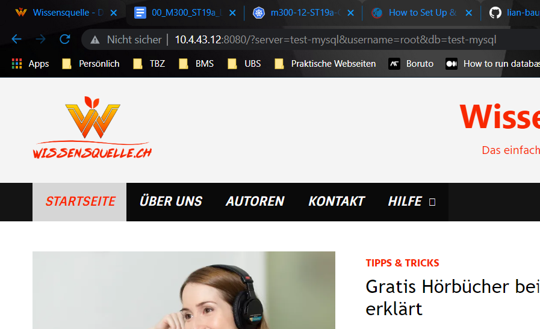
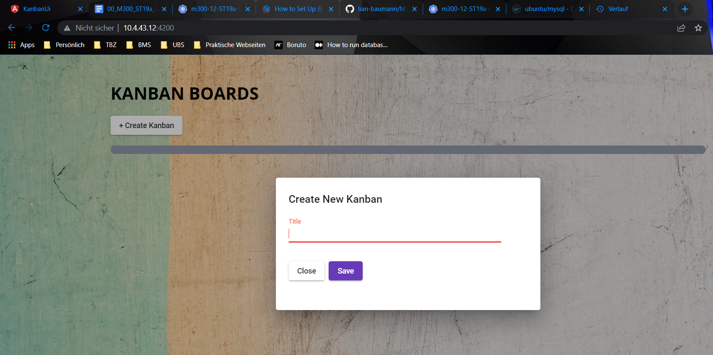
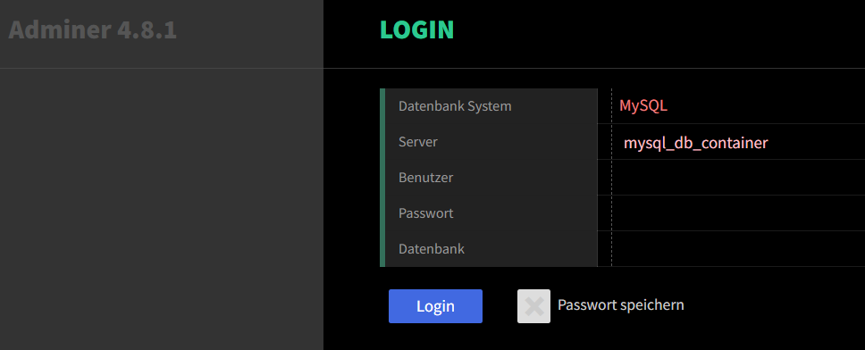

# Einleitung
Das LB2 Projekt wurde etwas verkürzt, da noch die TOB Projektwoche dazwischen kam. Das Ziel ist es, einen Webserver aufzusetzen als Frontend, und einen MySQl-Container als Backend. Diese werden dann miteinander verknüpft.

# Inhaltsverszeichnis
- [Einleitung](#einleitung)
- [Inhaltsverszeichnis](#inhaltsverszeichnis)
  - [Projekt 1: Webserver deklarativ aufsetzen](#projekt-1-webserver-deklarativ-aufsetzen)
  - [Projekt 2: Web-Applikation deployen](#projekt-2-web-applikation-deployen)
    - [Datenbank überprüfen](#datenbank-überprüfen)
  - [Projekt 3: DB per Webinterface managen](#projekt-3-db-per-webinterface-managen)
  - [Quellen](#quellen)

## Projekt 1: Webserver deklarativ aufsetzen
Zuerst installieren wir Docker Compose, falls es noch nicht installiert ist.

    sudo apt-get install docker-compose
    sudo apt-get install docker
Dann erstellen wir einen Ordner, in dem wir später unsere Dateien haben möchten.

    mkdir lb2
Dort drin erstellen wir dann ein Dockerfile und index.html. Im Dockerfile definieren wir deklarativ unsere Umgebung, und im index.html fügen wir logischerweise unseren HTML code für die Webseite ein. In meinem Fall habe ich den Code meiner Webseite www.wissensquelle.ch genommen.
        
    nano Dockerfile

Und wir fügen folgenden Input ein:

    FROM ubuntu/apache2
    COPY index.html /var/www/html/
    EXPOSE 8080
Hier definieren wir das image, welches wir installieren möchten. In meinem Fall ist das Apache 2. Dann kopieren wir unser index.html file auf den Container. Im dritten Schritt definieren wir den Port 8080 als Output.

Nun erstellen wir noch das index.html file:

    nano index.html
Und wir fügen unseren Code ein. Ein einfaches Beispiel wäre folgendes. Natürlich kann hier auch eine komplexe Website eingefügt werden:

    <h1>Das isch en Titel</h1>
Jetzt builden wir unser image aus dem Dockerfile:

    docker build -t lb2-webserver .
    docker images

Nun lassen wir das image laufen mit docker run. Wichtig: hier ist der erste Port (8080) der Port, an den es gesendet wird und der zweite Port (80) ist der Port von dem es auf dem Container kommt.

    docker run --name lb2-webserver -d --hostname lb2-webserver -p 8080:80 lb2-webserver

Jetzt kann über die IP und den Port auf die Webseite zugegriffen werden. Auch wenn der Container gelöscht und redeployed wird, die Webseite wird sich nicht verändern.

    http://<ipaddress>:8080

 

## Projekt 2: Web-Applikation deployen
Beim zweiten Projekt ging es mir darum, mal eine wirkliche Applikation mit einem Webserver und einer Datenbank zu deployen. Dazu verwende ich folgende Applikation: https://github.com/wkrzywiec/kanban-board

Erst erstellen wir einen Ordner für unser Projekt.

    mkdir huddleboard_application
    cd huddleboard_application

Dann klonen wir die Applikation von Github in unseren Ordner.

    git clone https://github.com/wkrzywiec/kanban-board.git
    cd kanban-board

Nun ist es wichtig, dass die Ports 8080 und 4200 noch nicht in Verwendung sind, sonst kommt es zu Problemen (ich spreche aus Erfahrung). Erstmals schauen wir uns das Dockerfile des Projektes an.

    cat docker-compose.yml

Wir sehen ein sehr komplexes dockerfile:

    version: '3'
    services:

      kanban-postgres:
        image: "postgres:9.6-alpine"
        container_name: kanban-postgres
        volumes:
          - kanban-data:/var/lib/postgresql/data
        ports:
          - 5432:5432
        environment:
          - POSTGRES_DB=kanban
          - POSTGRES_USER=kanban
          - POSTGRES_PASSWORD=kanban

      kanban-app:
        build: ./kanban-app
        container_name: kanban-app
        environment:
          - DB_SERVER=kanban-postgres
          - POSTGRES_DB=kanban
          - POSTGRES_USER=kanban
          - POSTGRES_PASSWORD=kanban
        ports:
          - 8080:8080
        links:
          - kanban-postgres

      kanban-ui:
        build: ./kanban-ui
        container_name: kanban-ui
        ports:
          - 4200:80
        links:
          - kanban-app

    volumes:
      kanban-data:

Hier werden drei verschiedene Container aufgesetzt. Einer für das User Interface, also für die Webseite, der zweite für die Applikation selber und der dritte für die Datenbank. Diese bekommen alle einige Parameter mit, wie z.B. den Port.

Nun lassen wir die Container laufen:

    docker-compose up

Wenn wir nun IPADRESSE:4200 im Browser eingeben, sehen wir das UI der Applikation. Wir können ganz einfach neue Einträge erstellen.

 

### Datenbank überprüfen
Erstmals vorweg: Bei mir funktionierte bei dieser Applikation die Verbindung von der Applikation zur Datenbank nicht ganz. Man erstellte also einen Huddle-Eintrag, dieser wird aber nicht angezeigt auf der Webseite und auch nicht in die DB eingetragen. Ich denke das hat damit zu tun, dass die Applikation schon etwa 5-jährig ist, und seit dann nicht wirklich viel geupdated wurde. Trotzdem zeige ich hier noch kurz, wie man die Einträge in der DB anschauen könnte.

Wir finden die Container ID der Datenbank "postgres:9.6-alpine" heraus. Mit docker ps sehen wir diese in der Liste.

    docker ps

Dann verbinden wir auf unsere DB mit folgendem Befehl:

    docker exec -it <containerID> bash

Wir kommen in den Container der Datenbank. Hier verbinden wir erstmals auf den postgres-benutzer. Bei dieser Applikation heisst er kanban.

    psql -U kanban -W

Dann verbinden wir auf die Datenbank. Das Passwort ist "kanban"

    \c kanban

Nun zeigen wir uns die Tables der DB an:

    \dt
Wir sehen die Liste mit den Datenbank Tabellen. Uns interessiert die "kanban". Um die Daten dieser Tabelle auszulesen verwenden wir folgenden Befehl:

    TABLE kanban;

In meinem Fall fällt das Resultat leider mager aus, aber wenn die Verbindung stehen würde, stünden die erstellten Huddle-Boards in dieser Tabelle.

## Projekt 3: DB per Webinterface managen
Mein drittes Projekt sollte, wenn es funktioniert, per UI auf einer Webseite die Möglichkeit bieten, eine Datenbank einzusehen und anzupassen.

Wir erstellen wieder einen Projektordner:

    mkdir db-administrator
    cd db-administrator

Dann erstellen wir ein docker-compose.yml file:

    nano docker-compose.yml

Dort drin schreiben wir unseren YAML-Code. Ich habe sehr viele verschiedene Versionen ausprobiert, am weitesten bin ich mit dieser gekommen:

    version: '3'
    services:
        mysql_db_container:
            image: mysql:latest
            command: --default-authentication-plugin=mysql_native_password
            ports:
              - 3307:3307
            volumes:
              - mysql_db_data_container:/var/lib/mysql
            environment:
              - MYSQL_ROOT_PASSWORD=1234
              - MYSQL_PASSWORD=1234
              - MYSQL_USER=mysql_user
              - MYSQL_DATABASE=mysql_test

        adminer_container:
            image: adminer:latest
            environment:
                ADMINER_DEFAULT_SERVER: mysql_db_container
                ADMINER_DESIGN: galkaev
            ports:
              - 8080:8080

    volumes:
        mysql_db_data_container:

Grob zusammengefasst erstellt dieses YAML file zwei Container. Der erste ist eine normale Mysql (oder andere) Datenbank auf dem Port 3307. Dabei wird auch ein Volume erstellt, auf dem alle Daten gespeichert werden sollen und wir definieren auch noch die Passwörter und Benutzer etc.

Der zweite Container ist ein adminer-Container. Adminer ist ein Image auf Dockerhub, welches die Möglichkeit bietet, per Webseite auf Datenbanken zuzugreifen. Wir geben hier auch den Port 8080 mit und definieren noch unseren MySQL-Container als Standard-Server. 

Nun müssen wir nur noch das Ganze starten:

    docker-compose up

Leider funktioniert das Ganze nur Teilweise. Das Adminer image funktioniert tadellos, man kann ohne Probleme auf die Webseite zugreifen und man sieht das UI mit den Auswahlmöglichkeiten. Leider kann man dann aus irgend einem Grund nicht auf die Datenbank zugreifen. Sie wird zwar erstellt und über die Commandozeile kann ich sie öffnen, jedoch scheint die Verbindung der beiden Container noch irgendwo nicht ganz richtig zu stimmen. Ich musste dann nach viel Troubleshooting das Ganze aufgeben. Es funktionierte weder mit zusätzlichen Parametern, anderen Ports, anderen Datenbanken und generell nicht. Trotzdem habe ich viel dabei gelernt.

 

## Quellen
https://dev.to/codewithml/setup-adminer-with-docker-for-database-management-4dd2
https://github.com/wodby/adminer/blob/master/tests/mariadb/docker-compose.yml
https://phoenixnap.com/kb/mysql-docker-container
https://hub.docker.com/r/ubuntu/mysql
https://github.com/wkrzywiec/kanban-board
https://github.com/mc-b/M300/tree/master/docker/compose