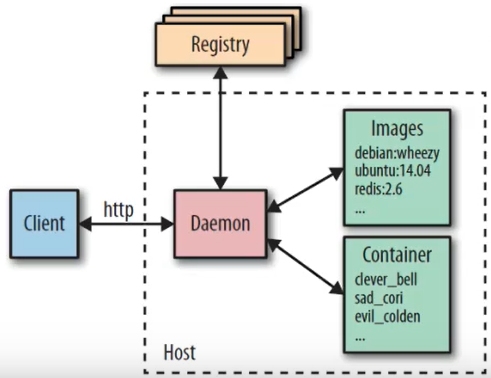
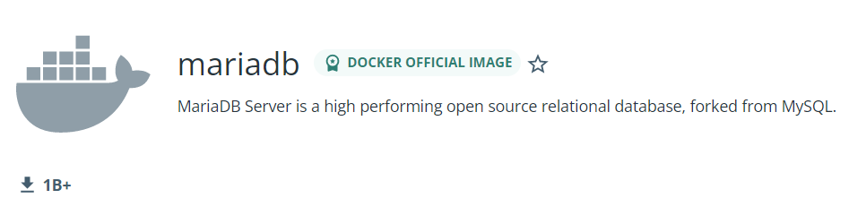

# Einleitung allgemein
Einleitung allgemein (Erklärungen zum ganzen M300-Projekt)

# Inhaltsverszeichnis
- [Einleitung allgemein](#einleitung-allgemein)
- [Inhaltsverszeichnis](#inhaltsverszeichnis)
  - [Vagrant](#vagrant)
    - [Apache Webserver automatisiert aufsetzen](#apache-webserver-automatisiert-aufsetzen)
  - [Docker](#docker)
    - [Docker erklärt](#docker-erklärt)
    - [Befehle](#befehle)
    - [Datenbank mit Docker aufsetzen](#datenbank-mit-docker-aufsetzen)
    - [Persistente Daten](#persistente-daten)
    - [Docker Build](#docker-build)
      - [Vorhandenes Image anpassen](#vorhandenes-image-anpassen)
      - [Neues Image erstellen](#neues-image-erstellen)
  - [20-Infrastruktur](#20-infrastruktur)
  - [35-Sicherheit 1](#35-sicherheit-1)
  - [30-Container](#30-container)
  - [35-Sicherheit 2](#35-sicherheit-2)
  - [40-Container-Orchestrierung](#40-container-orchestrierung)
  - [50-Add-ons](#50-add-ons)
  - [60-Reflexion](#60-reflexion)
  - [Quellen](#quellen)

## Vagrant
Vagrant ist ein deklarativer Deployment anbieter für Containerumgebungen. Es ermöglicht uns, anhand eines Scriptes, ein System aufzusetzen. Dadurch, dass man die VM's jeweils immer vom gleichen Script deployed, sind sie konsistent und ersparen viel Arbeit. Wenn Probleme mit dem Server auftauchen, kann die VM einfach "Destroyed" werden und neu aufgesetzt, und schon ist die VM wieder clean. 
Im Vagrantfile gibt man das Image an, welches man deployen möchte (z.B. Ubuntu) und verlinkt auch ein Provisioning file, in dem man zusätzliche Befehle für das System hinzufügen kann. Es lohnt sich z.B. in diesem Provisioning file den Befehl <b>sudo apt-get update</b> einzubauen, dass die VM jeweils direkt geupdated wird. Natürlich kann man auch gleich Installationen durchführen, wie z.B. <b>sudo apt install nginx</b>.

        sudo apt-get update
        sudo apt-get install nginx

### Apache Webserver automatisiert aufsetzen
Mit Vagrant kann man automatisiert ein System anhand von einem yml script erstellen. Das ist das Deklarative Deployment, also es wird nicht jede Maschine manuell deployed. Wir deployen hier einen Apache 2 Webserver anhand des Vagrant files.

Nachfolgend wird die VM mit einem bereits abgeänderten File bzw. VM aus dem M300-Repository erstellt:

1. Terminal öffnen
2. In das M300-Verzeichnis (/home/ubuntu/M300/vagrant/web) wechseln:

        cd /home/ubuntu/M300/vagrant/web

3. VM erstellen und starten:

        vagrant up

4. Webbrowser auf dem Laptop starten und über die IP (10.4.43.12:8080 verbinden.)
5. Im Ordner /web die Hauptseite index.html editieren bzw. durch eine andere ersetzen (z.B. HTML5up-Themplate) und das Resultat überprüfen
6. Abschliessend kann die VM wieder gelöscht werden:
   
        vagrant destroy -f
7. Vagrant ist nun komplett einsatzfähig!

## Docker
### Docker erklärt
Docker ist ein Container anbieter, welcher uns ermöglicht, anhand vom Docker Deamon, unsere Container zu deployen und zu managen. Es besteht aus verschiedenen Komponenten, welche uns dabei unterstützen: 
 

<b>Daemon</b> 
Der Docker Daemon ist für das Managen der Infrastruktur zuständig. Er weiss, wo die Images abgelegt werden, welche Container gerade laufen und welches die standard registry ist. Wir kommunizieren also über den Daemon mit den Docker-containern. 

<b>Images</b> 
Docker basiert auf Images. Dort drin sind alle benötigten Informationen vorhanden, um dann einen Container zu erstellen. Sie sind also sozusagen Containervorlagen, welche man zu containern ausführen kann. Diese Images müssen aber zuerst lokal in der Image-Umgebung platziert werden. Es stehen uns externe Registries zur Verfügung, wie z.B. Dockerhub, von dem wir vorgefertigte images direkt herunterladen können. Es ist auch möglich, ein image selbst zu erstellen und von diesem zu deployen. 
Wie bereits gesagt, nimmt der Deamon dann ein Image und deployed es als Container.

### Befehle
Dies ist ein Cheat sheet zu Docker Containern, auf dem man alle wichtigen Befehle sieht:
[docker_cheat_sheet.pdf](ImagesDocs/docker_cheat_sheet.pdf)

### Datenbank mit Docker aufsetzen
Wir benutzen die TBZ-Maas-VM von Herrn Calisto, welche eine Ubuntu Distribution am laufen hat. Darauf installieren wir erst mal Docker.

    sudo apt-get install docker

Im nächsten Schritt suchen wir uns ein passendes Docker-image auf dem Dockerhub:
 

Wir laden das ubuntu/mysql image vom Dockerhub herunter:

    docker pull ubuntu/mysql

Mit docker images kann man alle images anzeigen auf dem System. Dann starten wir den Container mit dem docker run Befehl:

    docker images
    docker run --name <containername> -e MYSQL_ROOT_PASSWORD=<password> -p 3306:3306 -d ubuntu/mysql

--name ist der Name, den wir für den Container definieren. Dann geben wir ein Passwort an und mit -p führen wir eine Portweiterleitung vom Container zum Host durch. Diese ist nötig, damit man vom Host auf die Datenbank zugreifen kann. 
Mit einem Datenbankclient wie z.B. MySQL Workbench können wir jetzt auf die Datenbank connecten.

### Persistente Daten
Damit unsere Daten konsistent bleiben im Container (also wenn der Container gelöscht und wiederaufgebaut wird bleibt alles gleich) konsistent bleiben, benötigen wir einen verlinkten Ordner. Um das zu erreichen, mounten wir zwei Ordner miteinander. Im Fall von mysql ist das /var/lib/mysql mit irgend einem Ordner auf unserem lokalen Rechner, wie z.B. /home/lian/mysql. 

Um diese Verlinkung der Volumes zu bekommen, müssen wir erstmals ein Volume erstellen:

    docker volume create mydbstore

Nun können wir überprüfen, mit welchem lokalen Ordner dieses Volume verknüpft ist, indem wir es inspizieren:

    docker volume inspect mydbstore

Unter "Mountpoint" sehen wir den lokalen Pfad des verlinkten volumes. Nun passen wir unseren Docker run Befehl nochmals an. Wir fügen <b>-v mydbstore:/var/lib/mysql</b> hinzu, das bedeutet, dass wir dieses erstellte Volume gerne verknüpfen möchten mit dem Order /var/lib/mysql.

    docker run --name <containername> -e MYSQL_ROOT_PASSWORD=<password> -v mydbstore:/var/lib/mysql -p 3306:3306 -d ubuntu/mysql

 
Nun kann man auf die DB connecten und einige Anpassungen vornehmen. Ich habe zum Beispiel eigene Schemas erstellt.  

Wenn wir die DB löschen und wieder starten, werden die Daten erfolgreich wiederhergestellt. Nun löschen wir sie erstmals mit folgenden Befehlen:

    docker ps #containerid herausfinden
    docker stop <containerID>
    docker rm <containerID>

Und dann starten wir den container wieder:

    docker run --name <containername> -e MYSQL_ROOT_PASSWORD=<password> -v mydbstore:/var/lib/mysql -p 3306:3306 -d ubuntu/mysql

 

Beim Wiederverbinden sehen wir, dass die Schemas weiterhin vorhanden sind, wir haben also eine konsistente Containerstruktur erstellt.

### Docker Build
#### Vorhandenes Image anpassen
Erst installieren wir ein Image und lassen einen Container laufen. Wir verwenden das ubuntu-image und nennen unsere Maschine "ubuntucontainer". Wir öffnen den container gleich im bash.

    docker run -it --name ubuntucontainer --hostname ubuntucontainer ubuntu bash

Im container drin updaten wir erstmals die Paketliste mit

    apt-get update

Dann installieren wir das Programm Cowsay:

    apt-get install -y cowsay fortune

Wir verlassen den Container

    exit

Nun erstellen wir ein image anhand des laufenden containers mit den neu installierten Programmen:

    docker commit ubuntucontainer cowsay-img

Wir können das neu erstelle Image anschauen. Wir sehen, dass das neue cowsay image grösser ist, als das ubuntu image, da wir ja Applikationen darauf installiert haben:

    docker images

Nun vergleichen wir die beiden vorhandenen images. Wir werden sehen, dass das cowsay image einen Layer oben drauf hat, welcher später created wurde als der Rest der Layers.

    docker history ubuntu
    docker history cowsay-img

Jetzt lassen wir unser neues image laufen mit dem Docker run befehl. Wir werden sehen, dass der neue Container tatsächlich die benötigten Applikationen installiert hat:

    docker run -it --name cowsaycontainer --hostname cowsaycontainer cowsay-img bash
    /usr/games/fortune |/usr/games/cowsay

#### Neues Image erstellen
Nun erstellen wir unser eigenes Image. Dafür erstellen wir uns einen Ordner, in diesem erstellen wir ein neues file namens "Dockerfile" und befüllen es mit Inhalt:

    mkdir Docker  # Ordner erstellen
    cd Docker
    touch index.html  # index File erstellen für apache
    echo "<h1>M300</h1>" > index.html # index befüllen mit html code
    nano Dockerfile  # Dockerfile erstellen und öffnen

Im Texteditor, der geöffnet wurde, schreiben wir nun unseren Input für das Dockerfile. Hier ein Beispiel:

    FROM ubuntu
    RUN apt-get update && apt-get install -y cowsay fortune apache2
    COPY index.html /var/www/html/
    CMD ["apachectl", "-D", "FOREGROUND"]
    EXPOSE 80

Kurze Erklärung, was hier gemacht wird: Zuerst wählen wir ein image aus, in unserem Fall ist das Ubuntu. Dann führen wir einen update und installationscommand aus auf dem container. Mit COPY kopieren wir unser lokales index.html file auf den Container. Dann führen wir noch einen CMD Befehl für Apache aus und geben den Port 80 nach aussen frei. 

Um aus dem erstellen File ein wirkliches image zu erstellen, führen wir folgenden Befehl aus:

    docker build -t cowsay-dockerfile .
    docker images # Images anzeigen

Nun müssen wir nur noch den Container laufen lassen:

    docker run --name cowsaycontainer2 -d --hostname cowsaycontainer2 -p 80:8080 cowsay-dockerfile

Auf dem lokalen Computer kann nun über Port 8080 auf das index.html zugegriffen werden:

    <IP-Adresse>:8080

## 20-Infrastruktur
Einträge (eigene Erkenntnisse während dem Bearbeiten dieses Kapitels)

## 35-Sicherheit 1
Einträge (eigene Erkenntnisse während dem Bearbeiten dieses Kapitels)

## 30-Container
Einträge (eigene Erkenntnisse während dem Bearbeiten dieses Kapitels)

## 35-Sicherheit 2
Einträge (eigene Erkenntnisse während dem Bearbeiten dieses Kapitels)

## 40-Container-Orchestrierung
Einträge (eigene Erkenntnisse während dem Bearbeiten dieses Kapitels)

## 50-Add-ons 
Einträge (eigene Erkenntnisse während dem Bearbeiten dieses Kapitels)

## 60-Reflexion
Lernprozess festgehalten (Form frei wählbar)

## Quellen
- https://github.com/mc-b/M300/
- https://web.microsoftstream.com/video/df4e25df-b998-4c19-9263-17d3f32a6015?list=user&userId=91407230-9462-4d68-a2e7-13e41cfe3aaf&referrer=https:%2F%2Fwww.google.com%2F

- - -
 Dieses Werk ist lizenziert unter einer <a rel="license" href="http://creativecommons.org/licenses/by-nc-sa/3.0/ch/">Creative Commons Namensnennung - Nicht-kommerziell - Weitergabe unter gleichen Bedingungen 3.0 Schweiz Lizenz</a>

- - -
